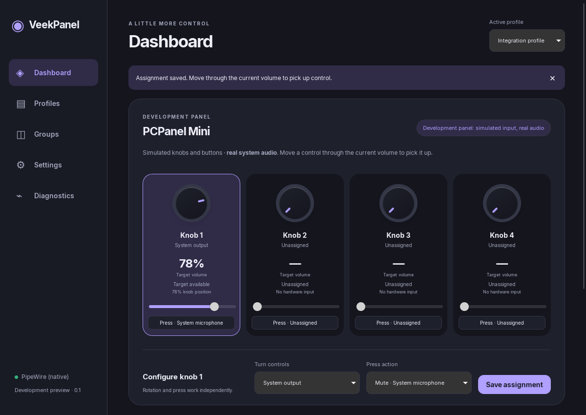

# VeekPanel

A Windows-first, open-source PCPanel controller project with first-class Nobara/Linux support.
**Current scope: hardware/audio diagnostics, saved mappings and a native desktop preview.**
Windows Core Audio and native PipeWire backends are implemented. Physical PCPanel
acceptance is partial: Mini basic controls passed on Windows 11; lifecycle and
Nobara hardware checks remain pending. The desktop preview now includes profiles,
groups, settings and a basic tray. A Windows preview installer is available; production acceptance and Linux packaging remain later work.

The target is a friend's **PCPanel Mini 1.0**, corrected from the earlier Original
identification. Its four knobs also act as four independent push buttons. Use the
Mini HID path; the friend's Windows 11 capture and checklist confirm all four
knob ranges, button edges, physical order and direction.

## Windows download

[Download the Windows desktop installer](https://github.com/apittman019-svg/VeekPanel/releases/tag/v0.1.0-preview.1).
Run the setup EXE, then open VeekPanel from Start. No developer tools required.
This is an unsigned preview for Windows 10/11 x64. See [installation and first use](docs/WINDOWS_INSTALLER.md).

## Native desktop preview

The backend-connected Tauri/Svelte app provides real audio discovery and volume/mute,
knob/button assignments, groups, profiles, saved configuration, settings and diagnostics.
An explicitly labeled development panel uses simulated hardware with real audio.
See [build/run instructions and current limitations](docs/CORE_AND_DESKTOP.md).
It is a development preview with a Windows installer, not a daily-driver release.



Captured from the native app using explicitly simulated Mini input and a private
PipeWire test server. [Light appearance](docs/images/desktop-preview-light.png).

## Hardware status

| Model | Discovery / transport | Status |
| --- | --- | --- |
| Original / Maple Wood Edition | Explicit serial port, 9600 baud | Experimental, based on compatible replacement firmware; unique USB identity and stock firmware unverified |
| RGB | HID `04d8:eb52` | Implemented from public protocol references; physical test pending |
| Mini (user reports 1.0) | HID `0483:a3c4` | Basic detection, four full-range knobs and four buttons verified on one Windows 11 unit; lifecycle/Nobara pending |
| Pro | HID `0483:a3c5` | Implemented from public protocol references; physical test pending |

Do not mistake replayed fixtures or a successful build for hardware compatibility.
The Milestone 1 gate remains open for lifecycle and Nobara physical checks; the
friend’s basic Windows Mini controls have already passed.

## Friend testing / downloadable diagnostic kit

The [M1 diagnostic release](https://github.com/apittman019-svg/VeekPanel/releases/tag/m1-probe-2026-10-03)
provides experimental Windows and Linux downloads. These are console test
utilities, not the finished application or installers. For Windows, extract the
whole ZIP and double-click **`TEST-MINI.cmd`** for the friend's **Mini 1.0**.
Close other PCPanel apps first. The test auto-detects the Mini HID interface, gives
90 seconds of knob/button prompts, and saves raw reports, decoded events, a summary
and a short `RESULTS.txt` checklist in `captures/mini-...`. Fill in the checklist,
review the files and zip that folder for return. No audio changes are expected.

The original `m1-probe-2026-10-03` archive predates this launcher. Use the
[Mini test release](https://github.com/apittman019-svg/VeekPanel/releases/tag/m1-mini-2026-10-04)
for `TEST-MINI.cmd`. `START-HERE.cmd` remains **Original/Maple-only**.

Manual Mini command: `veek-probe test-mini` (Linux: `./veek-probe test-mini`).
No COM selection or Device Manager is needed. Ambiguous Mini interfaces cause an
explicit error; no arbitrary device is opened. Empty captures are clearly flagged.
Reports and startup snapshots alone cannot certify physical controls.

Raw captures include unrecognized bytes. A replay/parser error is useful evidence,
not a reason to flash firmware. Nothing is uploaded automatically. Captured metadata
always says hardware validation is unverified. Builds are currently unsigned.

## M2 native audio diagnostics

Download the [experimental M2 audio kit](https://github.com/apittman019-svg/VeekPanel/releases/tag/m2-audio-2026-10-04).
On Windows, extract the ZIP and run `LIST-AUDIO.cmd` for a read-only listing;
see the included README for explicit volume/mute commands.

The separate `veek-audio-probe` lists outputs, inputs and live app sessions/streams,
observes changes, and explicitly sets volume/mute. It also supports a temporary
single-knob/button test with volume pickup. M1's `veek-probe` remains read/capture only.

```sh
cargo run -p veek-audio-probe -- list
cargo run -p veek-audio-probe -- watch --duration 30
# Changes the current default output volume:
cargo run -p veek-audio-probe -- set --target default-output --volume 25
```

See [audio usage, architecture and acceptance](docs/AUDIO_VALIDATION.md) before
hardware binding. These are experimental console utilities; a finished GUI is M4.

## Run the developer utility

Install [Rust](https://www.rust-lang.org/tools/install) and the prerequisites for
[Windows](docs/WINDOWS_SETUP.md) or [Nobara/Linux](docs/LINUX_SETUP.md).
The toolchain is pinned in `rust-toolchain.toml`; `Cargo.lock` pins dependencies.

```sh
cargo build --workspace --locked
cargo run -p veek-probe -- list
cargo run -p veek-probe -- watch
```

For the Original, identify its port by comparing `list` before/after plugging it in:

```sh
# Windows example (use your actual COM port):
cargo run -p veek-probe -- watch --serial COM3 --raw
# Nobara example (prefer the actual persistent /dev/serial/by-id/... path):
cargo run -p veek-probe -- watch --serial /dev/ttyUSB0 --raw
```

`watch` retries failed connections every three seconds, reports parser errors,
handles Ctrl+C and supports `--duration 10`. `--no-init` suppresses the HID
state-request write; Original serial never receives protocol writes. Opening some
serial boards can reset them. Unrecognized serial adapters are never auto-opened.
`list` prints device identifiers/paths for local diagnosis; review before sharing.

Collect evidence from one explicit Original serial connection:

```sh
mkdir captures
cargo run -p veek-probe -- capture --serial COM3 --output captures/trial-1 --duration 60
```

Use the actual port (Linux paths also work). The output parent must exist; the trial
directory must not exist. Raw bytes are capped at 1 MiB by default (`--max-bytes` can
set 1 byte through 16 MiB), and duration at 1–300 seconds. Capture stops on disconnect
instead of mixing sessions. `serial.bin` is directly usable with Original replay;
`chunks.tsv` records host read timings/boundaries; `metadata.txt` records stop reason.
Caps exclude the bounded hex/metadata representation, which adds roughly 2x raw size
plus a line per read. Port paths and USB serial numbers are not stored in metadata.

Offline checks (these use explicitly synthetic fixtures):

```sh
cargo run -p veek-probe -- replay --model original tests/fixtures/original.txt
cargo run -p veek-probe -- replay --model pro tests/fixtures/pro.hex
cargo test --workspace --locked
cargo clippy --workspace --all-targets --locked -- -D warnings
cargo fmt --all --check
# Linux-only synthetic serial integration:
python3 tests/serial_pty.py
python3 tests/capture_pty.py
```

Example **offline** output:

```text
KNOB_1 = 73 (raw=73/100)
KNOB_2 = 42 (raw=42/100)
KNOB_3_PRESS = TRUE
KNOB_3_PRESS = FALSE
```

These are physical positions, not OS volume readings. See [verification](docs/VERIFICATION.md)
and the [real-hardware checklist](docs/HARDWARE_VALIDATION.md).

## Project map

- [AGENTS.md](AGENTS.md): requirements, scope gates and instructions for future sessions.
- [Research and stack decision](docs/RESEARCH.md), [protocol](docs/HARDWARE_PROTOCOL.md),
  [architecture](docs/ARCHITECTURE.md), [milestones](docs/MILESTONES.md).
- `crates/veek-hardware`: model descriptors, pure parsers, transport and session boundary.
- `crates/veek-probe`: hardware diagnostics CLI; no GUI dependencies.
- `tests`: synthetic fixtures and Linux PTY integration; Rust tests live with crates.
- `packaging/linux`: narrowly scoped HID udev rules, not a finished package.

MIT for original VeekPanel code; [research provenance](docs/RESEARCH.md) records upstream
licenses. No affiliation with PCPanel; no firmware or vendor binaries are redistributed.
