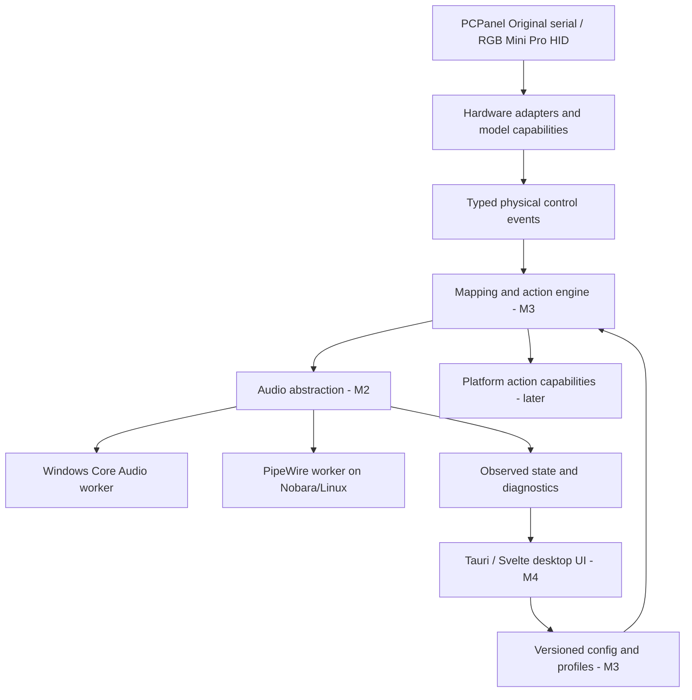

# Architecture

## Scope and chosen direction

Windows 10/11 is primary; Nobara Linux is the first Linux acceptance platform.
The end product is a user-session desktop application that controls real PCPanel
hardware and native OS audio. It must work without a terminal or elevated runtime.
The M1 CLI is a developer diagnostic, not the finished end-user experience.

**Implemented:** protocol types/parsers, model-specific validation, HID/serial I/O,
cancelable reading, bounded event delivery, reconnect retry, local CLI diagnostics.
**Planned only:** every audio, mapping, configuration, profile, UI, tray and installer
component below. No success stubs or dummy audio endpoints exist.

## Boundaries and repository layout

Rust workspace conventions replace empty top-level component directories:

| Component | Ownership | Implementation milestone |
| --- | --- | --- |
| `crates/veek-hardware` | Model capabilities, pure decoders, transport handles, physical events | M1, exists |
| `crates/veek-probe` | Local diagnostic CLI, discovery/retry and worker orchestration | M1, exists |
| Future `crates/veek-audio` | Target IDs, capability flags, command/event contract | M2 |
| Future `crates/veek-audio-windows` | COM/Core Audio only | M2 |
| Future `crates/veek-audio-linux` | PipeWire/WirePlumber interaction only | M2 |
| Future `crates/veek-core` | Identity matching, engine, groups and profile switching | M3 |
| Future `crates/veek-config` | Validated schema, atomic saves, backups, migrations, import/export | M3 |
| Future `app` and `ui` | Tauri composition/tray and TypeScript/Svelte views | M4/M5 |
| `tests`, `docs`, `packaging` | Fixtures/integration tests, evidence, eventual packaging | Incremental |

Platform selection belongs in build-target dependencies and the app composition
root, not scattered throughout engine/UI code. Do not add unused audio traits or
empty stub packages merely to make M1 resemble a completed app.

## Hardware contract and execution

Each analog event preserves raw position and source maximum. Button edges are
separate events even when the button shares a knob. The CLI displays rounded
percentages and one-based labels; wire indices remain zero-based internally.
Future capability descriptors must express sliders, buttons and LEDs independently.

`Transport` isolates actual device reads/writes for mock tests. `Session` owns the
decoder and handle. Every reconnect creates a new session and fresh partial-line
state. Known HID devices open by exact path. Original serial is explicitly selected
because a unique stock identity has not yet been verified. Serial compatibility
traffic is distinct from hardware identification.

M1 uses one worker per opened interface and blocking reads with finite timeouts.
The supervisor receives through a 256-message bounded channel. A three-second
discovery/retry scan is a portable prototype fallback. Shutdown signals readers,
drops the receiving end to unblock senders and joins the workers. Slow stdout can
backpressure the device workers; M1 is not an audio hot-path latency guarantee.
OS driver open/write calls are not guaranteed cancelable by this Rust boundary.

Before daily-driver use, move hotplug to platform notifications with slow reconciliation
fallback, add suspend/resume notifications, and isolate output/logging. Coalesce
analog positions by control under load but never silently drop press/release edges.
Keep state events ordered per device and include connection generations so stale
commands cannot affect a replacement handle. Idle heartbeat or USB silence alone
must not be interpreted as a control action. Silent reset recovery remains to test.

## Planned audio contract

Backends provide snapshots and subscriptions for outputs, inputs and application
streams/sessions. Commands include set normalized gain, set mute and capability-
gated default selection. Return explicit missing target, unavailable backend,
permission, unsupported and disconnected results. Never invent success.

The model tracks both desired command state and OS-observed state, with command
context/generation tags to prevent feedback loops. External mixer changes update
the UI. Windows owns COM subscriptions on an MTA worker. Linux owns proxies and
listeners on a PipeWire event-loop thread. Both invalidate transient objects on
service restart and reconcile subscriptions before accepting queued commands.
No audio enumeration or device I/O runs on the UI thread.

Normalize volume in the core, but leave conversion to backend-native gain/dB and
channel-preservation rules in the backend. Validate finite values and default to
0–100% without accidental amplification. Absolute physical pots need an explicit
pickup/soft-takeover policy after app/profile changes; M1 does not choose volume
or activate a button action from its initial state snapshot.

## Planned identity, mapping, profiles and persistence

- Windows: prefer stable application/package identity and executable path, then
  executable name and audio-session metadata. PIDs/session handles only resolve
  live objects. Treat multiple sessions and executable aliases explicitly.
- Linux: use `application.id`, process binary, application name and media/node
  metadata in ranked rules. PipeWire global IDs and object serials are only live
  identifiers, not durable mapping keys. A browser can expose many streams.
- Resolve matches with confidence and show ambiguity in diagnostics. Do not silently
  apply broad fallback matches to an unrelated application.
- One control may select several targets or a named group. Groups retain member
  intent when apps are absent; relative member gain is preserved by a defined group
  gain rule. Profile switches atomically replace mappings, avoiding mixed states.
- Use schema-versioned JSON via Serde, validated before replacing in-memory state.
  Store under the user's config directory. Atomic replacement plus backup precedes
  migrations; unsupported future versions remain untouched. Test corrupted/truncated
  files, interrupted writes, round-trip import/export and every migration.
- Platform-neutral selectors and optional platform-specific match hints allow
  dual-boot profile reuse. Profile IDs are stable; display names are editable.

## Planned UI and background lifecycle

Tauri 2 hosts a Svelte/TypeScript UI with narrow typed IPC, local bundled content,
CSP and minimal permissions. No remote control HTTP server or remote shell. Shared
state snapshots/subscriptions power a real device dashboard, connect screen,
drag-and-drop assignments and diagnostics. UI controls appear enabled only when
the backend capability works. Replay/demo data must remain conspicuously labeled.

Use generous spacing, rounded cards, accessible focus/keyboard support, modern
icons, smooth indicators, clean typography and dark/light themes. Respect reduced
motion, scaling and contrast. Do not create a mock UI before hardware/audio gates.

The user-session backend later survives window close; tray actions cover open,
profile, microphone mute, status, settings and quit. Startup is opt-in. Avoid a
system/root service for ordinary control. Linux foreground-app detection is
compositor-dependent; automatic profile switching is an optional capability.

## Packaging, security and diagnostics

Windows installer plus optional portable build; prioritize Flatpak/AppImage on
Linux with RPM/DEB possible. Flatpak hardware access needs a dedicated feasibility
test; host udev rules cannot simply be installed from inside the sandbox. Nobara
permissions must be tested in an ordinary local desktop session. Any installation
elevation is separated from runtime. M1 supplies rules but does not install them.

The future diagnostics screen includes model/USB IDs, known firmware data, status,
raw events, audio devices/sessions, identity matching and recent errors. A copyable
report redacts user paths, serials and unnecessary personal data. M1 CLI output is
local raw diagnostics and is not that redaction feature. Logs must be bounded.

Configured commands/shortcuts are explicit user actions, validated on import and
executed locally with clear opt-in. Never expose arbitrary execution remotely.
Profile imports must not automatically execute embedded commands.

## Acceptance measurements

Record idle CPU and memory on Windows and Nobara, startup time, reconnection time,
and physical-input-to-observed-audio latency with p50/p95/p99. Targets are near-zero
idle CPU and no perceptible control delay; establish actual baselines before setting
numeric release budgets. No claim of production reliability is made by a fast
parser test or a no-device idle run.
